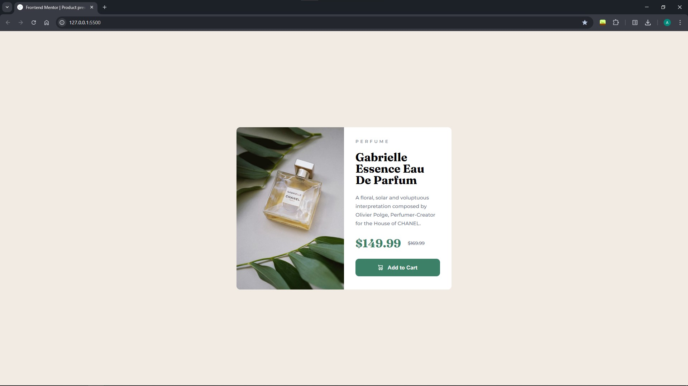
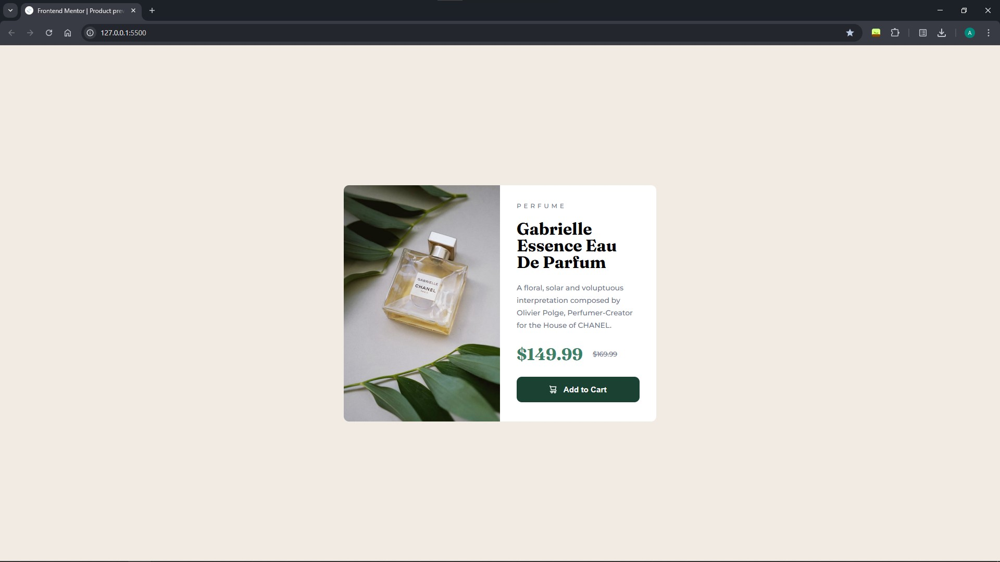
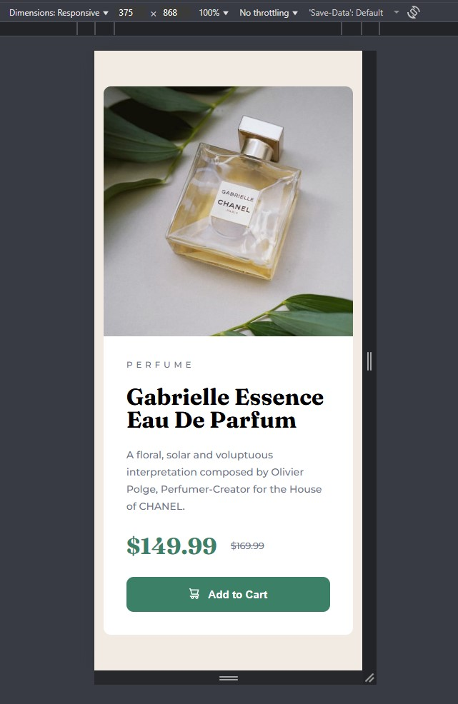

# Frontend Mentor - Product preview card component solution

This is a solution to the [Product preview card component challenge on Frontend Mentor](https://www.frontendmentor.io/challenges/product-preview-card-component-GO7UmttRfa).
## Table of contents

- [Overview](#overview)
  - [The challenge](#the-challenge)
  - [Screenshot](#screenshot)
  - [Links](#links)
  - [Built with](#built-with)

## Overview

### The challenge

Users should be able to:

- View the optimal layout depending on their device's screen size
- See hover and focus states for interactive elements

### Links

- Live Site URL: [Site on github pages](https://y-c-y-k-a.github.io/Product-preview-card-component/)

### Screenshot

Desktop version

Hover on button

Mobile version

### Built with

- Semantic HTML5 markup
- CSS custom properties
- Flexbox